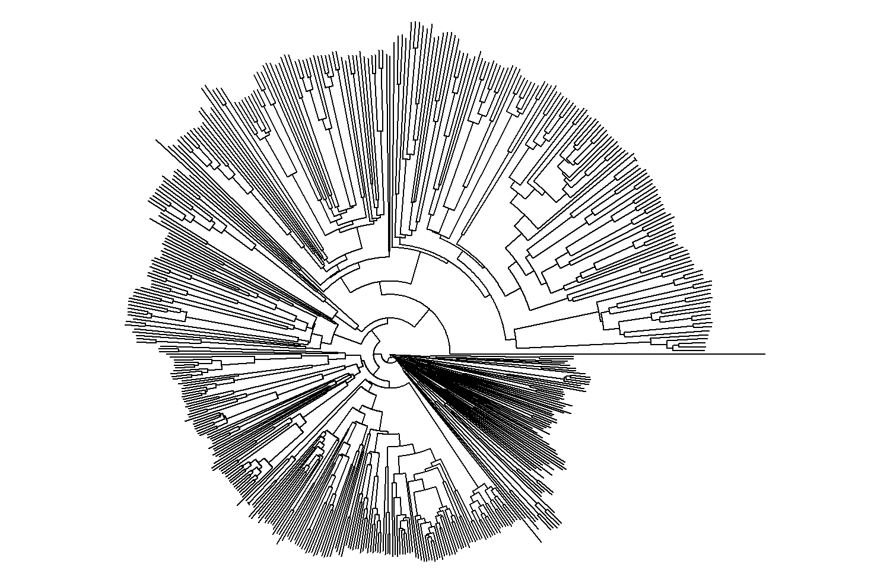

# eDNA-for-MPAs
Workflow and scripts for processing eDNA metabarcoding data from Marine Protected Areas in Nova Scotia, Canada. 

#1. Study sites

Since 2019, data is included from the [Eastern Shore Islands Area of Interest](https://www.dfo-mpo.gc.ca/oceans/aoi-si/easternshore-ilescoteest-eng.html), [St. Anns Bank MPA](https://www.dfo-mpo.gc.ca/oceans/mpa-zpm/stanns-sainteanne/index-eng.html), the [Fundian Channel-Browns Bank AOI](https://www.dfo-mpo.gc.ca/oceans/aoi-si/fundian-fundy-browns-eng.html) and the [Gully MPA](https://www.dfo-mpo.gc.ca/oceans/mpa-zpm/gully/index-eng.html). 

The following repositories include other analyses conducted for various Maritimes conservation areas: 
[Eastern Shore Islands AOI](https://github.com/dfo-mar-mpas/easternshoreislands_aoi)
[Fundian Channel - Browns Bank](https://github.com/dfo-mar-mpas/fundian_aoi) 
[St. Anns Bank MPA](https://github.com/dfo-mar-mpas/stannsbank_mpa) 
[Musquash Estuary](https://github.com/dfo-mar-mpas/musquash_mpa)

#2. Bioinformatics
We use a combination of the R package *dada2* and the [QIIME2 Pipeline](https://docs.qiime2.org/2022.2/interfaces/q2cli/) to trim raw reads, de-noise, and assign taxonomy to our reads. 
## Workflow
1. Import data and summarize if de-multiplexed. Check read quality with FastQC.
2. Use **cutadapt** either on its own or in QIIME to remove primers and/or adapters.
3. Then use *dada2* to denoise paired sequences, ensuring to trim/truncate sequences to an appropriate length. 
4. Create a phylogenetic tree which aligns sequences using MAFFT and creates an unrooted tree.
5. Conduct diversity analyses (alpha and beta diversity, PCoA etc)
6. Assign taxonomy to our sequence features using a classifier, BLAST, or [FuzzyID2](https://onlinelibrary.wiley.com/doi/10.1111/1755-0998.12738)
7. **Rescript** plugin for QIIME was used to create a reference database for 12S and 16S fish sequences. The downloaded sequences can be filtered and evaluated before using to assign our metabarcodes taxonomic classifications. 
8. In QIIME we use the feature-classifier with our reference classifier object and our representative sequences, and generate a tsv table of classifications.

